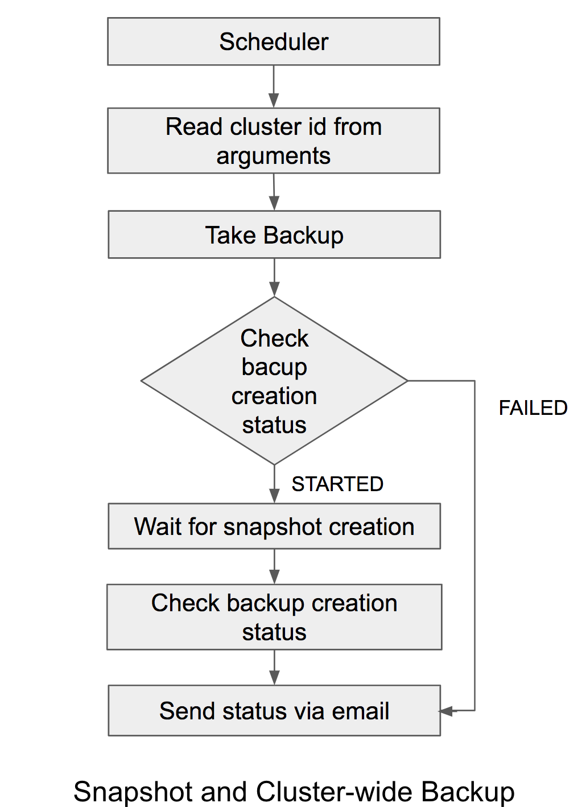
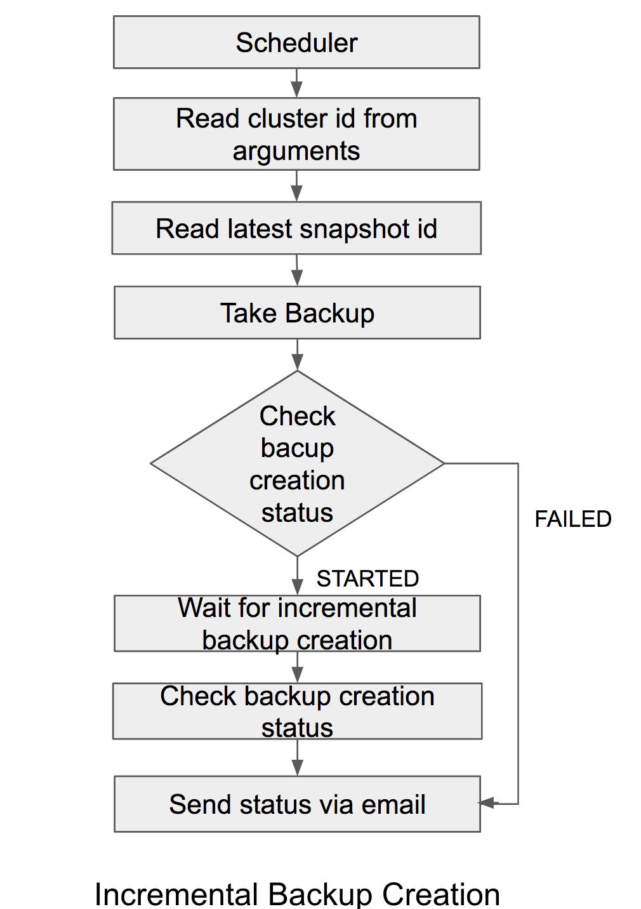

# Periodic Backup Creation Script

## Introduction
Periodic backup creation script is a script for creating backups at the scheduled time. It will create backups with the help of Cassy commands.

## Background and Objectives
Cassy is a simple and integrated backup tool for Apache Cassandra,It will help to create different types of backups manually. Periodic backup creation script will ensure the backup creation with the help of cassy grpcurl manual commands.

This is a system for maintaining Cassandra node backups. It will help to automatically manage snapshot creation, Cluster-wide backup creation and incremental backup creation during the scheduled time period. 

## Requirements
The primary design goals of periodic backup creation is to create backups in a specified period of times. It  will help avoid loss of data while Cassandra node is damaged.

- Start backup creation at specific times.
- Create specific type of backups in an arbitrary schedule (snapshot or cluster-wide backup or incremental backup)
- Cluster_id and snapshpt_id are automatically read.
- Backup creation frequency modification should be easy for everyone.
- Notify status of backup creation.

## Work Flow
<p align="center">


</p>

## Implementation

### Snapshot Creation and Cluster-wide Backup Creation

Cluster wide backup creation and snapshot creation can be automated with the help of periodic backup creation scripts. 

The Cassandra cluster should be pre-registered before scheduling the script to create the backup. The backup creation script will read cluster id from arguments and snapshot creation will be started using Cassy backup command. After proper snapshot creation, it will send backup creation status as email notification.

- take_snapshot.sh :- Create snapshot for each cassandra nodes
- take_cluster_wide_snapshot.sh :- Create cluster wide backup

### Incremental Backup
Incremental backup creation can be automated with the help of periodic backup creation scripts. 

The Cassandra cluster should be pre-registered before scheduling the script to create the backup and make sure that, the snapshot will be created for the same cluster-id before starting incremental backup creation. The backup creation script will read the latest snapshot id of specified cluster-id with the help of cassy commands and it will conduct incremental backup creation also with the help of cassy command. After proper backup creation, it will send backup creation status as email notification.
- take_incremental_backup.sh :- script for creating incremental backup

Do not use the same cluster id for cluster-wide backup creation and incremental backup creation. Snapshot and incremental backup creation should be used the same cluster id.

## How to use tool

Cassy server `/opt/automate/backup` directory contains backup creation script.

- Register new cluster
```
$ grpcurl -plaintext -d '{"cassandra_host": "cassandra-1.internal.scalar-labs.com"}' localhost:20051 rpc.Cassy.RegisterCluster
```

- Schedule Snapshot Creation Script
   
   Configuration file and cluster id should passed as command line argument
```
 /opt/automate/backup/take_snapshot.sh /opt/automate/backup/config_snapshot  <cluster-id>
```

- Schedule Cluster-wide Backup Creation Script
   
   Configuration file and cluster id should passed as command line argument
```
 /opt/automate/backup/take_cluster_wide_snapshot.sh /opt/automate/backup/config_cluster_wide  <cluster-id>
```

- Schedule Incremental Backup Creation Script
   
   Configuration file and cluster id should passed as command line argument
```
 /opt/automate/backup/take_incremental_backup.sh /opt/automate/backup/config_incremental_backup  <cluster-id>
```

Example cron schedule
```
30 0 * */1 * /opt/automate/backup/take_cluster_wide_snapshot.sh /opt/automate/backup/config_cluster_wide <cluster-id>
15 0 * * 0 /opt/automate/backup/take_snapshot.sh /opt/automate/backup/config_snapshot <cluster-id>
0 * * * * /opt/automate/backup/take_incremental_backup.sh /opt/automate/backup/config_incremental_backup <cluster-id>
``` 